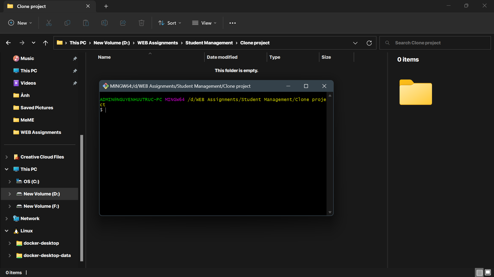
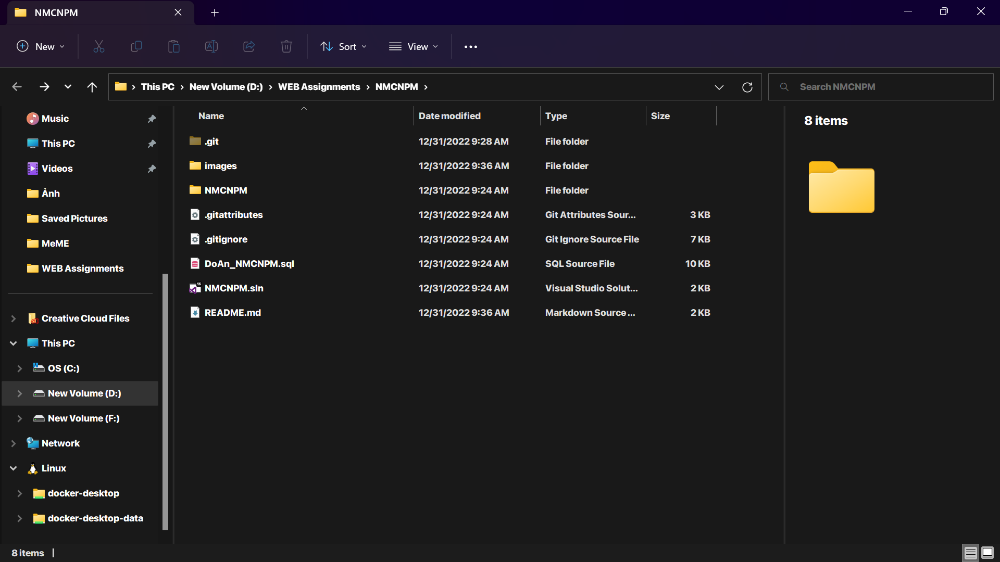

# ỨNG DỤNG QUẢN LÝ HỌC SINH

## I. THÔNG TIN ỨNG DỤNG

### 1. Giới thiệu

Đây là sản phẩm đồ án kết thúc môn học Nhập Môn Công Nghệ Phần Mềm của nhóm 11 lớp 20_4 trường đại học Khoa Học Tự Nhiên - Đại Học Quốc Gia Tp.Hồ Chí Minh. Sản phẩm có tên là "Phần mềm quản lý học sinh", dùng để quản lý học sinh của một trường học thay thế cho việc phải quản lý các thông tin trên giấy tờ theo kiểu truyền thống.

### 2. Công nghệ sử dụng

#### 2.1 Front-end

- C#
- Giao diện: WPF (Windows Presentation Foundation)

#### 2.2 Back-end

- C#, .NET Framework 4.7.2
- Database: SQL Server 2019

### 2.3 Các công cụ hỗ trợ

- IDE: Visual Studio 2017, 2019, 2022
- Quản lý database: SQL Server Management Studio 2019
- Quản lý mã nguồn: Git, Github

### 3. Môi trường thực thi

Các thiết bị sử dụng hệ điều hành windows.

### 4. Một số tính năng chính

- Đăng nhập, tạo tài khoản
- Tạo danh sách lớp
- Thêm học sinh vào lớp
- Tổng hợp điểm theo môn học, lớp, ...
- Tổng hợp điểm theo học kỳ, năm học, ...
-

## II. CÀI ĐẶT VÀ SỬ DỤNG

### 1. Cài đặt

#### 1.1 Tải project về máy

Mở thư mục trống bạn dùng để chứa project, tạo một git bash cmd tại đây

Sau đó chạy câu lệnh sau để tải project về máy:

```bash
git clone https://github.com/Vanniee007/NMCNPM.git
```

Thư mục sau khi tải project


### 2. Chạy ứng dụng

## III. CHI TIẾT ỨNG DỤNG

### 1. Cấu trúc thư mục

```bash
├───NMCNPM
│   ├───bin
│   ├───icon
│   │   ├───close.png
│   │   ├───home.png
│   │   ├───logout.png
│   │   ├───mimi.png
│   │   ├───resize.png
│   │   ├───user.png
│   │   └───window.png
│   ├───obj
│   ├───Properties
│   │   ├───AssemblyInfo.cs
│   │   ├───Resources.Designer.cs
│   │   ├───Resources.resx
│   │   ├───Settings.Designer.cs
│   │   └───Settings.settings
│   ├───Admin_Windows.xaml
│   ├───Admin_Windows.xaml.cs
│   ├───App.config
│   ├───App.xaml
│   ├───App.xaml.cs
│   ├───DBconnect.cs
│   ├───MainWindow.xaml
│   ├───MainWindow.xaml.cs
│   └───NMCNPM.csproj
├───images
│   ├───demo_folder.png
│   └───project_folder.png
├───.gitattributes
├───.gitignore
├───DoAn_NMCNPM.sql
├───NMCNPM.sln
├───README.md
```

### 2. Mô tả các chức năng chính

#### 2.1 Đăng nhập

#### 2.2 Tiếp nhận học sinh

#### 2.3 Quản lý điểm

#### 2.4 Quản lý lớp


### 3. Các tính năng phát triển trong tương lai

- Thống kê trực quan bằng biểu đồ

- Thêm tính các tính năng quản lý giáo viên
