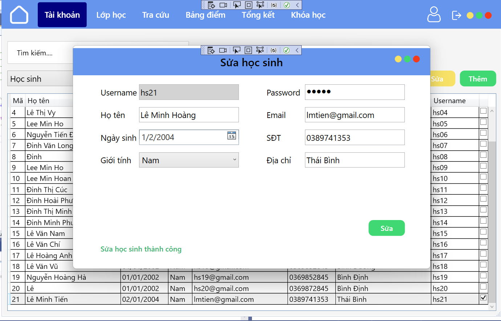
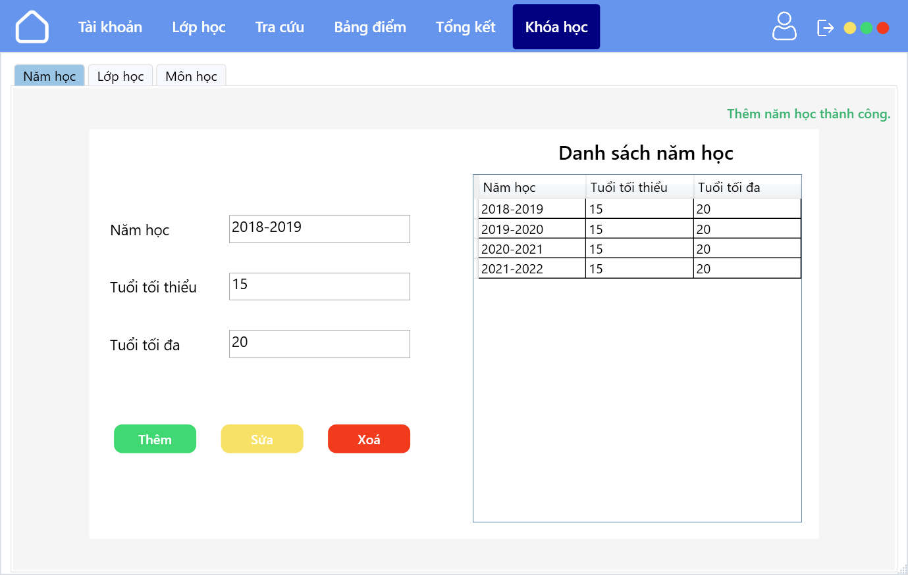

# ỨNG DỤNG QUẢN LÝ HỌC SINH

## I. THÔNG TIN ỨNG DỤNG

### 1. Giới thiệu

Đây là sản phẩm đồ án kết thúc môn học Nhập Môn Công Nghệ Phần Mềm của nhóm 11 lớp 20_4 trường đại học Khoa Học Tự Nhiên - Đại Học Quốc Gia Tp.Hồ Chí Minh. Sản phẩm có tên là "Phần mềm quản lý học sinh", dùng để quản lý học sinh của một trường học thay thế cho việc phải quản lý các thông tin trên giấy tờ theo kiểu truyền thống.


### 2. Công nghệ sử dụng

#### 2.1 Front-end

- C#
- Giao diện: WPF (Windows Presentation Foundation)

#### 2.2 Back-end

- C#, .NET Framework 4.7.2
- Database: SQL Server 2019

### 2.3 Các công cụ hỗ trợ

- IDE: Visual Studio 2017, 2019, 2022
- Quản lý database: SQL Server Management Studio 2019
- Quản lý mã nguồn: Git, Github

### 3. Môi trường thực thi

Các thiết bị sử dụng hệ điều hành windows.
Visual Studio 2017, 2019, 2022
SQL Server 2019

### 4. Một số tính năng chính

- Đăng nhập (Admin, Giáo viên, Học sinh)
- Thêm, sửa, xóa, tìm kiếm (Admin, Giáo viên, Học sinh)
- Lập danh sách lớp
- Tra cứu thông tin
- Quản lý bảng điểm
- Lập bảng tổng kết (môn, lớp)
- Quản lý khóa học (quy định)
- In bảng điểm, tổng kết ra file csv

## II. CÀI ĐẶT VÀ CẤU HÌNH

### 1. Cài đặt

#### 1.1 Tải project về máy

Mở thư mục trống bạn dùng để chứa project, tạo một git bash cmd tại đây

Sau đó chạy câu lệnh sau để tải git project về máy:

```bash
git clone https://github.com/Vanniee007/NMCNPM.git
```

Thư mục sau khi tải project


### 2. Cấu hình và chạy ứng dụng

Mở ứng dụng bằng phần mềm Visual Studio (Trong ảnh là Visual Studio 2022)


## III. CHI TIẾT ỨNG DỤNG

### 1. Cấu trúc thư mục

```bash
├───NMCNPM
│   ├───icon
│   │   ├───close.png
│   │   ├───home.png
│   │   ├───logout.png
│   │   ├───mimi.png
│   │   ├───resize.png
│   │   ├───user.png
│   │   └───window.png
│   ├───Properties
│   │   ├───AssemblyInfo.cs
│   │   ├───Resources.Designer.cs
│   │   ├───Resources.resx
│   │   ├───Settings.Designer.cs
│   │   └───Settings.settings
│   ├───Admin_themTaiKhoan.xaml
│   ├───Admin_themTaiKhoan.xaml.cs
│   ├───Admin_Windows.xaml
│   ├───Admin_Windows.xaml.cs
│   ├───App.config
│   ├───App.xaml
│   ├───App.xaml.cs
│   ├───DBconnect.cs
│   ├───GiaoVien_Windows.xaml
│   ├───GiaoVien_Windows.xaml.cs
│   ├───HocSinh_Windows.xaml
│   ├───HocSinh_Windows.xaml.cs
│   ├───InputValidation.cs
│   ├───MainWindow.xaml
│   ├───MainWindow.xaml.cs
│   ├───NMCPNPM.csproj
│   └───Vang query mới.sql
├───images
│   ├───add_student.png
│   ├───demo_folder.png
│   ├───home.png
│   ├───lap_danh_sach_lop.png
│   ├───login.png
│   ├───project_folder.png
│   ├───project_visual_studio.png
│   ├───update_student.png
│   └───youtube.png
├───.gitattributes
├───.gitignore
├───DoAn_NMCNPM.sql
├───NMCNPM.sln
├───README.md
```

### 2. Mô tả các chức năng chính

#### 2.1 Đăng nhập
<!-- Hinh anh dang nhap -->


#### 2.2 Thêm, sửa, xóa, tìm kiếm
<!-- Them hoc sinh -->
Thêm học sinh:

<!-- Sua hoc sinh -->
Sửa học sinh:

<!-- Xoa hoc sinh -->
Xóa học sinh:


#### 2.3 Lập danh sách lớp


#### 2.4 Tra cứu thông tin


#### 2.5 Quản lý bảng điểm


#### 2.6 Lập bảng tổng kết (môn, lớp)


#### 2.7 Quản lý khóa học (quy định)



#### 2.8 In bảng điểm, tổng kết ra file csv


## IV. CÁC TÍNH NĂNG PHÁT TRIỂN TRONG TƯƠNG LAI

- Thống kê trực quan bằng biểu đồ
- Hệ thống phản hồi cho người dùng

## V. LINK VIDEO DEMO
<!-- link video -->
[](https://youtu.be/1Q2Q3Q4Q5Q6)
